<div align="center">


</div>


<div align="center">


</div>


# 💫 About Me

<div align="center">

<table>
<tr>
<td valign="top" width="55%">


</td>
<td valign="top" width="45%" align="center">



</td>
</tr>
</table>

</div>


# ⚡ Tech Stack

<p align="center">

</p>


# 📊 Github Statistics

<p align="center">


</p>


# 🔥 Github Streak

<p align="center">

</p>


# 📈 Contribution Graph

<p align="center">

</p>


# 🐍 Contribution Snake

<div align="center">


</div>


# 🏆 Github Trophy

<p align="center">

</p>


# 📊 Metrics

<p align="center">


</p>
<p align="center">


</p>


# 🚀 Featured Projects

| Project | Description |
|----------|-------------|
| 🔐 Authentication API | Golang + Gin + JWT |
| 🍽 QR Cafe Ordering | React + Golang |
| 🧺 Laundry System | Fullstack Application |
| 📦 Inventory System | Dashboard + CRUD |
| 💈 Barbershop Booking | Booking Management |
| 🌐 Portfolio Website | React + Tailwind |


# 📚 Currently Learning

```text
████████████████████░░░░ 80%  Golang
████████████████████░░░░ 80%  React
████████████████░░░░░░░░ 65%  Docker
████████████░░░░░░░░░░░░ 50%  PostgreSQL
████████░░░░░░░░░░░░░░░░ 30%  Kubernetes
██████░░░░░░░░░░░░░░░░░░ 25%  AWS
```


# 📫 Connect With Me

<p align="center">
<a href="mailto:draconik514@gmail.com">

</a>
<a href="https://github.com/draconik514">

</a>
</p>


<div align="center">


</div>
