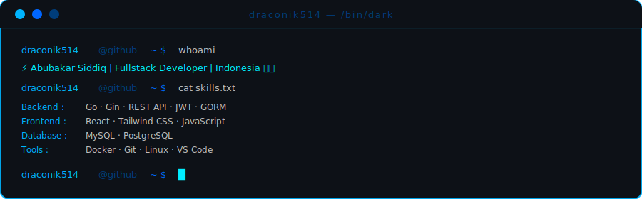
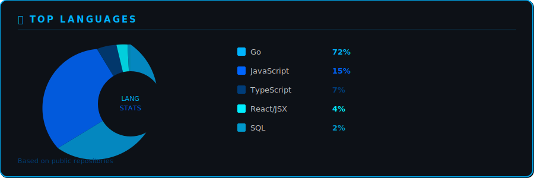
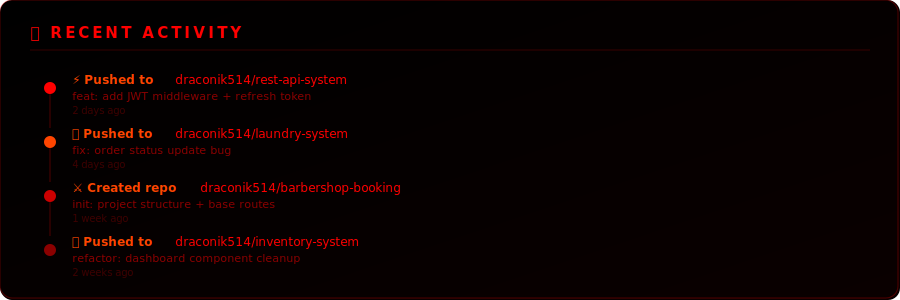
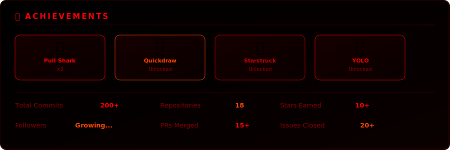
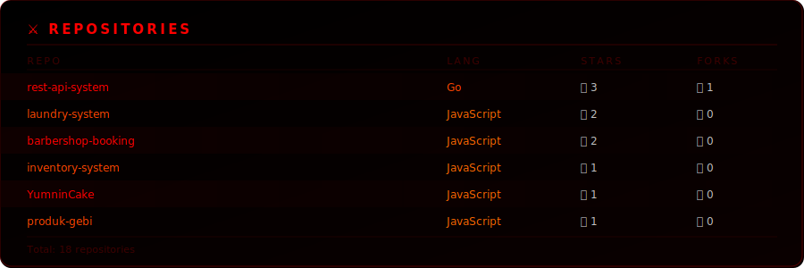
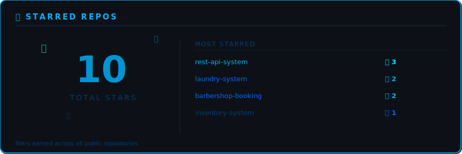

<table width="100%" bgcolor="#0d1117" cellpadding="0" cellspacing="0" border="0">
<tr><td align="center">

</td></tr>
</table>

<table width="100%" bgcolor="#0d1117" cellpadding="16" cellspacing="0" border="0">
<tr><td align="center">

## 💫 About Me

 

<table border="0" cellpadding="8" bgcolor="#0d1117">
<tr>
<td align="center" style="border: 3px solid #00b4ff; border-radius: 12px; padding: 8px;">

</td>
</tr>
</table>

</td></tr>
</table>

<table width="100%" bgcolor="#0d1117" cellpadding="16" cellspacing="0" border="0">
<tr><td align="center">

## ⚡ Tech Stack

## 📊 Github Statistics

## 🔥 Github Streak

## 📈 Contribution Graph

## 📊 Metrics

## 🚀 Featured Projects

| Project | Description | Tech |
|---------|-------------|------|
| 🔐 Authentication API | REST API with auth | Go + Gin + JWT |
| 🍽 QR Cafe Ordering | QR-based ordering system | React + Golang |
| 🧺 Laundry System | Fullstack laundry app | Fullstack |
| 📦 Inventory System | Dashboard + CRUD | JavaScript |
| 💈 Barbershop Booking | Booking management | JavaScript |
| 🌐 Portfolio Website | Personal portfolio | React + Tailwind |

## 📚 Currently Learning

## 📫 Connect With Me

</td></tr>
</table>
